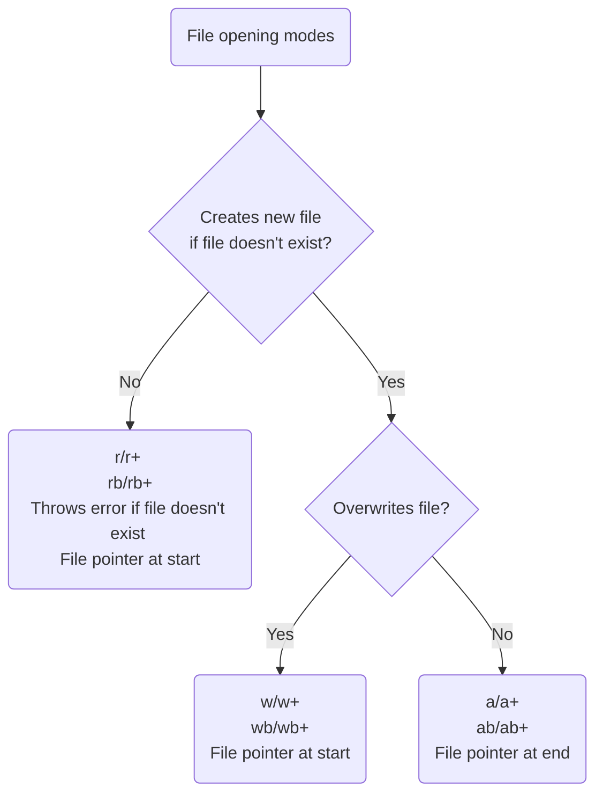

## Access Modes

- Optional argument
- By default it is read mode (r)
- Access mode is added as a string

| S. No. | Mode     | Binary Equivalent | Purpose              | Creates New File | Offset    |
| ------ | -------- | ----------------- | -------------------- | ---------------- | --------- |
| 1      | r        | rb                | Read-only mode       | No               | Beginning |
| 2      | r+ or +r | rb+  or r+b       | Read and write mode  | No               | Beginning |
| 3      | w        | wb                | Write Mode           | Yes              | Beginning |
| 4      | w+ or +w | wb+ or w+b or +wb | Write and Read Mode  | Yes              | Beginning |
| 5      | a        | ab                | Append mode          | Yes              | End       |
| 6      | a+ or +a | ab+ or a+b or +ab | Read and Append Mode | Yes              | End       |

All append and write modes (regular and binary) create a new file if the given file name/path does not exist. If you try to open a file which does not exist in read mode, you will get a `IOError`.

If you add the name of the file directly, the program will search for the file in the **current working directory/present working directory**.

**Fun Fact:** you can open text files in binary mode since they are stored in the binary format

