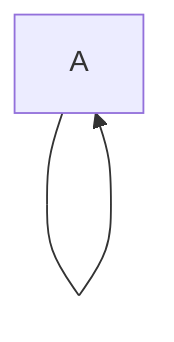
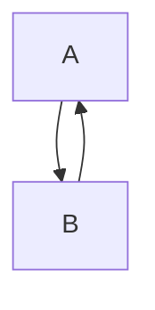

# Recursion

## Introduction to Recursion

Recursion is an intuitive use of functions to solve problems. Recursion involves calling a function over and over again until a certain point. It is also known as **self-invocation** of a function.

### Direct Recursion

This kind of recursion occurs when a function calls itself:



Python example:

```python
def func1():
    return func1()

func1()
```

### Indirect Recursion

When two or more functions call each other:



Python example:

```python
def func1():
    return func2()

def func2():
    return func1()

func1()
```

In both the cases, the recursion will go on forever and to prevent excess resource usage, Python stops the recursion and gives the error `RecursionError: maximum recursion depth exceeded`.

In order to stop the recursion at some point, we need to provide a **base case**.

### Base Case

The base case provides a condition to terminate recursion. It is a known case which we know will occur at some point in the program.

### Recursive Case

The recursive case is a general case which causes the function to call itself repeatedly.

## Important Recursive Algorithms

### Sum of n numbers

We know that the sum of n numbers is 1 + 2 + 3 + 4 + 5 + ... + n, but we want to go in the reverse order since we know the last number to add but not first in this case.

i.e. in n + (n-1) + (n-2) + ... + 1 we know the last number, but not in 1 + 2 + 3 + ... + n since n is variable.

Thus we can set our base case for when `n == 1`.

In our general case, we want to add the value currently passed to the next value i.e. n + (n-1) + ...

So, we keep the general case as `n + function(n-1)`

```python
def sumn(n):
    
    # base case
    if n == 1:
        return 1
  	
    # recursive case
    return n + sumn(n-1) # adds n + (n-1) + (n-2) + ... + 1

sumn(10)
```

Output: `55`

### a to the power b

In this function we want to multiply a by itself b times.

```python
def power(a, b):
    
    # base case
    if b == 0:
        return 1
    
    # recursive case
    return a * power(a, b-1)
```

### Factorial

In this function we want to calculate for a given n n * (n-1) * (n-2) * ...  * 1

```python
def factorial(n):
    
    if n == 1:
        return 1
    
    return n * factorial(n-1) # n * (n-1) * (n-2) * ... * 1

factorial(10)
```

Output: `3628800`

### Print String Backwards

In this function we want to print the string in the reverse order

```python
def reverse(string, i):
    
    # base case
    if i == 0:
        print(string[0])
        return
    
    # recursive case
    print(string[i], end="") # prints string[i] + string[i-1] + ... + string[1]
    reverse(string, i-1)
    
s = "Hello World!"
reverse(s, len(s) - 1)
```

Output: `!dlroW olleH`

### Fibonacci Numbers

The Fibonacci sequence is the sequence 0, 1, 1, 2, 3, 5, 8, .. where a term $F_n = F_{n-1} + F_{n-2}$.

```python
def fibonacci(n):
    
    # base cases
    if n == 0:
        return 0
    if n == 1:
        return 1
    
    # recursive case
    return fibonacci(n-1) + fibonacci(n-2)

fibonacci(9)
```

Output: `34`

We can use the function to print n elements in the sequnce

```python
def sequence(n):
    
    for i in range(1, n+1):
        print(fibonacci(i), end=" ")
        
sequence(10)
```

Output: `1 1 2 3 5 8 13 21 34 55`

### Binary Search

```python
def binary_search(arr, x, l, u):
	
    # base case
    if l >= u:
        return -1
    
    # recursive case
    mid = (l + u) // 2
    
    if arr[mid] == x:
        return mid
    elif arr[mid] > x:
        return binary_search(arr, x, l, mid-1)
    else:
        return binary_search(arr, x, mid + 1, u)
   
arr = [1,2,3,4,5,6]
binary_search(arr, 5, 0, len(arr)-1)
```

Output: `4`

## Recursion v/s Iteration

- Recursion can generally be used for problems involving loops
- One may be better than the other depending upon the problem

| Recursion                                                    | Iteration                                                    |
| ------------------------------------------------------------ | ------------------------------------------------------------ |
| Fresh memory space is allocated for each recursive call      | The same memory locations are used for variables and the code is repeated in each iteration |
| Often Slower                                                 | Often Faster                                                 |
| Makes solution slower and similar to a mathematical representation of the problem | More efficient, but may be lengthier than  a recursive solution |

